# Bob-DTA Extension - Technical Architecture

## High-Level Component Architecture

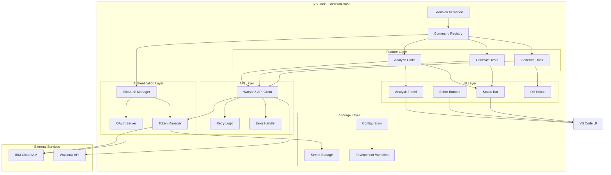

## Authentication Flow

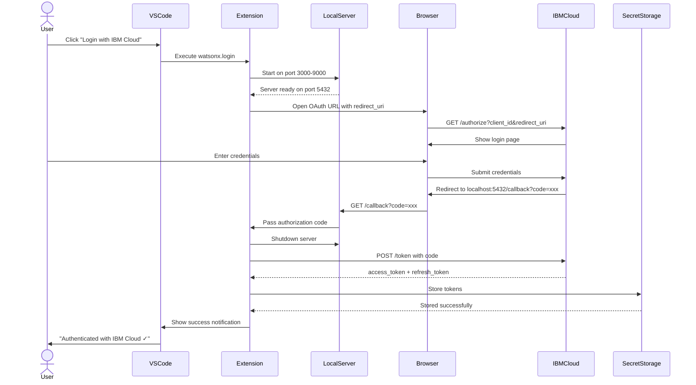

## API Request Flow with Token Refresh

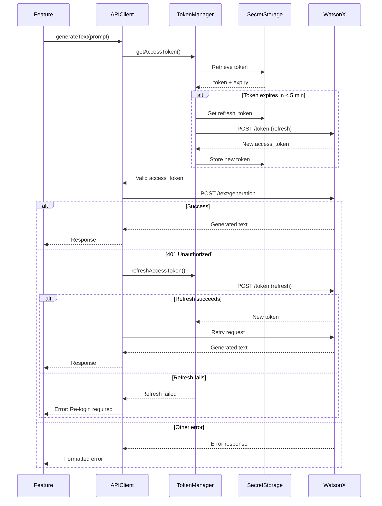

## Generate Documentation Feature Flow

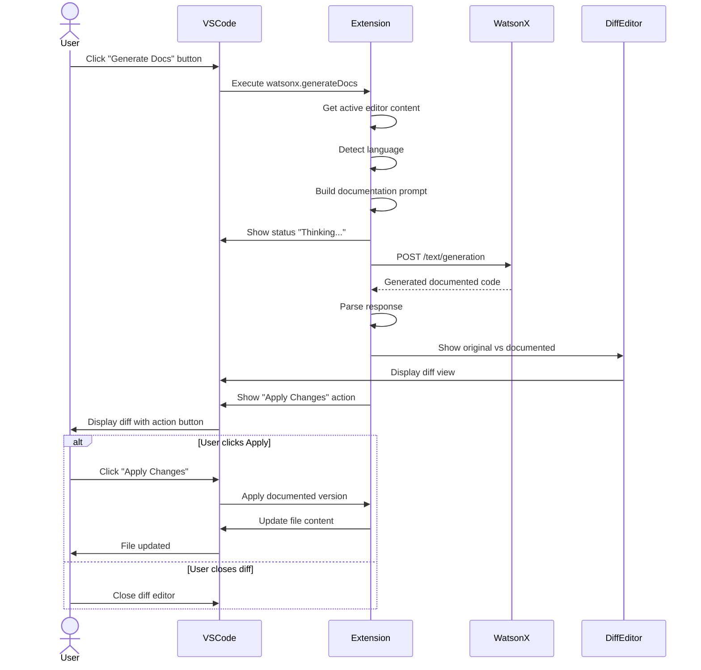

## Generate Tests Feature Flow

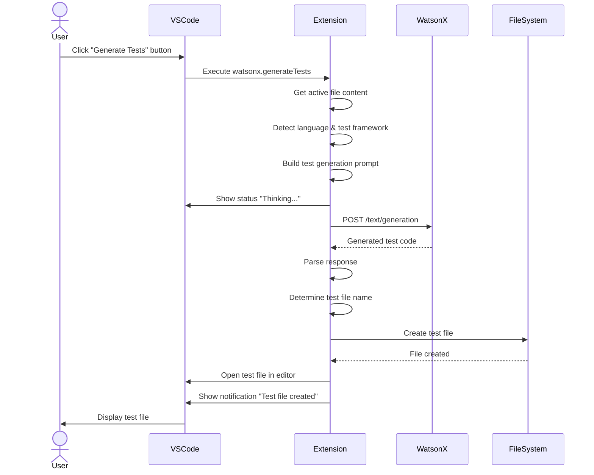

## Analyze Code Feature Flow

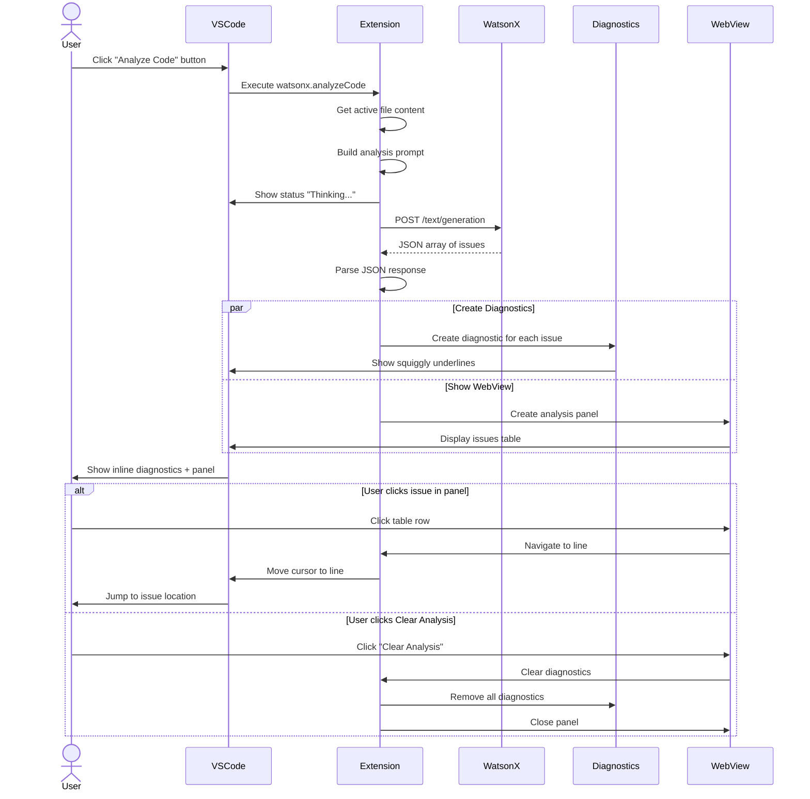

## Data Flow Architecture

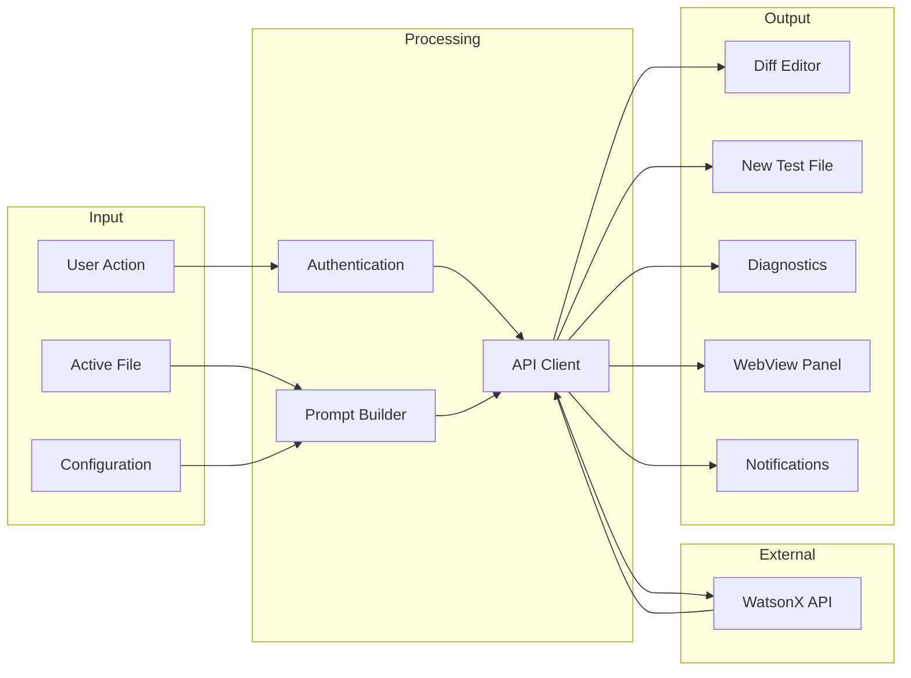

## State Management

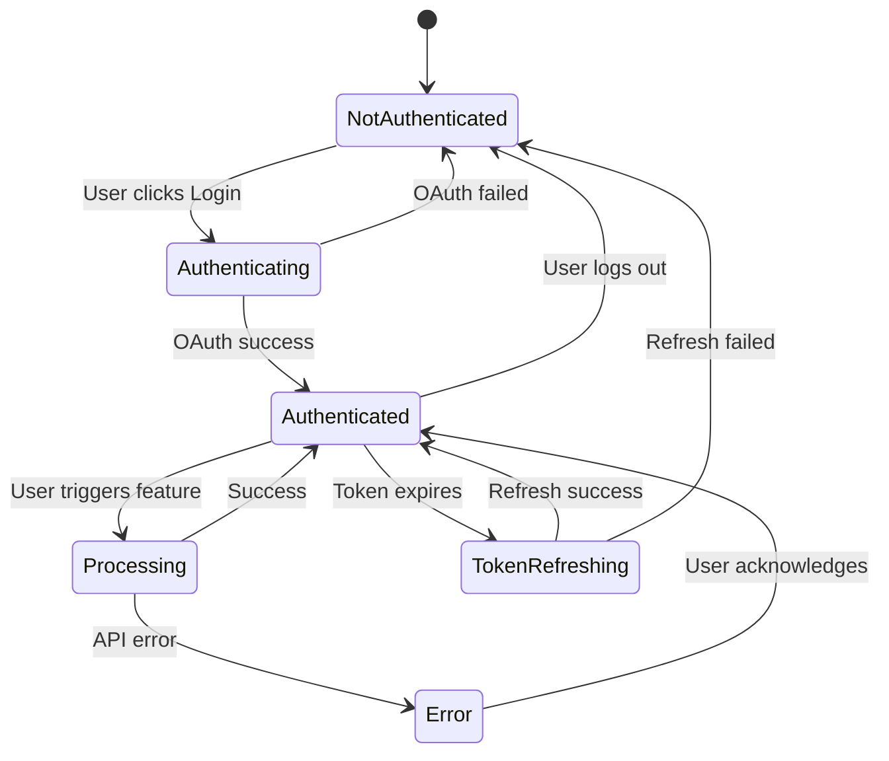

## Error Handling Strategy

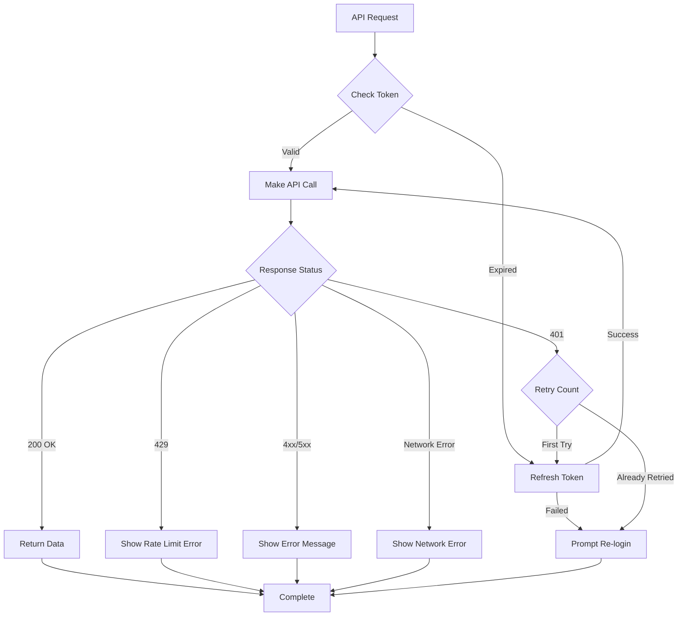

## File Organization by Responsibility

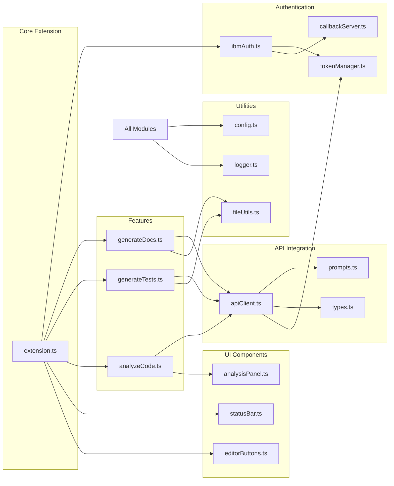

## Security Architecture

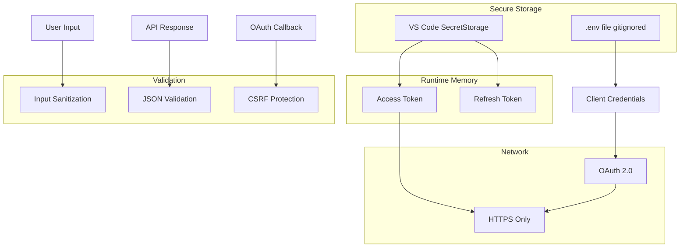

---

## Key Design Decisions

### 1. Token Management
- **Decision:** Use VS Code SecretStorage for tokens
- **Rationale:** Encrypted, secure, platform-agnostic
- **Alternative Considered:** OS keychain (platform-specific)

### 2. OAuth Callback
- **Decision:** Local HTTP server on random port
- **Rationale:** Standard OAuth flow, no external dependencies
- **Alternative Considered:** Deep links (less reliable)

### 3. API Client Architecture
- **Decision:** Single client with retry logic
- **Rationale:** Centralized error handling, DRY principle
- **Alternative Considered:** Per-feature clients (more duplication)

### 4. Prompt Management
- **Decision:** Template strings in separate file
- **Rationale:** Easy to modify, version control friendly
- **Alternative Considered:** Inline prompts (harder to maintain)

### 5. Test File Creation
- **Decision:** Create in same directory as source
- **Rationale:** Standard convention, easy to find
- **Alternative Considered:** Separate test directory (requires project structure knowledge)

### 6. Analysis Display
- **Decision:** Both diagnostics and WebView panel
- **Rationale:** Inline + detailed view, best of both worlds
- **Alternative Considered:** Only diagnostics (less detail) or only panel (less discoverable)

### 7. Configuration Storage
- **Decision:** VS Code settings + .env for secrets
- **Rationale:** User preferences in settings, secrets in .env
- **Alternative Considered:** All in .env (less discoverable)

### 8. Error Handling
- **Decision:** Automatic retry with token refresh
- **Rationale:** Better UX, handles common auth issues
- **Alternative Considered:** Immediate error (more user friction)

---

## Performance Considerations

1. **API Calls:** Debounce auto-analyze on save (max 1 call per 5 seconds)
2. **Token Refresh:** Check expiry before each call to avoid mid-request expiry
3. **WebView:** Lazy load, only create when needed
4. **Diagnostics:** Clear old diagnostics before adding new ones
5. **File Operations:** Use streaming for large files if needed

---

## Extensibility Points

1. **New Features:** Add to features/ directory, register command
2. **New Models:** Update configuration enum, modify API client
3. **New Languages:** Add to language detection logic
4. **Custom Prompts:** User-configurable prompt templates (future)
5. **Multiple Providers:** Abstract API client interface (future)