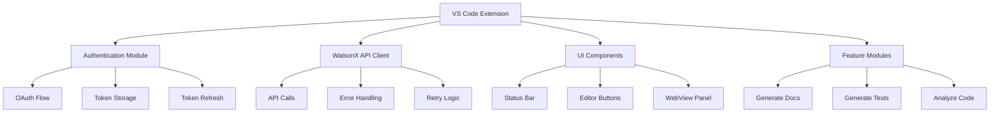
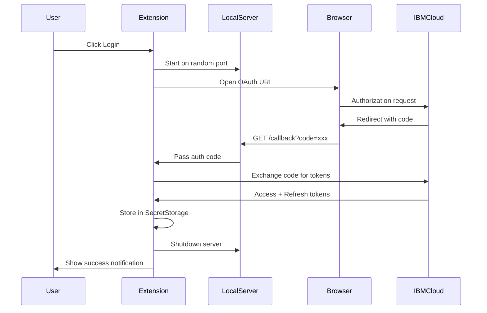

# Bob-DTA VS Code Extension - Implementation Plan

## Project Overview
**Name:** Bob-DTA (Documentation, Test generation, and Analysis)  
**Purpose:** AI-powered code assistance using IBM watsonx.ai and Granite models  
**Tech Stack:** TypeScript, VS Code Extension API, Node.js 20+, IBM Cloud IAM OAuth

---

## Architecture Overview



---

## Project Structure

```
bob-dta-extension/
├── src/
│   ├── extension.ts              # Main entry point
│   ├── auth/
│   │   ├── ibmAuth.ts           # OAuth flow orchestration
│   │   ├── callbackServer.ts    # Local HTTP server for OAuth
│   │   └── tokenManager.ts      # Token storage & refresh
│   ├── watsonx/
│   │   ├── apiClient.ts         # WatsonX API integration
│   │   ├── prompts.ts           # Prompt templates
│   │   └── types.ts             # TypeScript interfaces
│   ├── features/
│   │   ├── generateDocs.ts      # Documentation generation
│   │   ├── generateTests.ts     # Test generation
│   │   └── analyzeCode.ts       # Code analysis
│   ├── ui/
│   │   ├── statusBar.ts         # Status bar management
│   │   ├── editorButtons.ts     # Toolbar button logic
│   │   └── analysisPanel.ts     # WebView for analysis
│   ├── utils/
│   │   ├── config.ts            # Configuration management
│   │   ├── logger.ts            # Logging utility
│   │   └── fileUtils.ts         # File operations
│   └── test/
│       ├── suite/
│       │   ├── auth.test.ts
│       │   ├── apiClient.test.ts
│       │   └── features.test.ts
│       └── runTest.ts
├── .env.example                  # Environment variables template
├── .gitignore
├── .vscodeignore
├── package.json
├── tsconfig.json
├── webpack.config.js
└── README.md
```

---

## Implementation Details

### 1. Project Initialization

**Files to create:**
- [`package.json`](package.json) - Extension manifest with commands, configuration, dependencies
- [`tsconfig.json`](tsconfig.json) - TypeScript compiler configuration
- [`webpack.config.js`](webpack.config.js) - Bundle configuration for extension
- [`.env.example`](.env.example) - Template for required environment variables
- [`.gitignore`](.gitignore) - Exclude node_modules, dist, .env

**Dependencies:**
```json
{
  "dependencies": {
    "dotenv": "^16.0.0",
    "express": "^4.18.0"
  },
  "devDependencies": {
    "@types/vscode": "^1.80.0",
    "@types/node": "^20.0.0",
    "@types/express": "^4.17.0",
    "@vscode/test-electron": "^2.3.0",
    "typescript": "^5.0.0",
    "webpack": "^5.80.0",
    "webpack-cli": "^5.0.0",
    "ts-loader": "^9.4.0"
  }
}
```

**Commands to register:**
- `watsonx.login` - Login with IBM Cloud
- `watsonx.logout` - Logout and clear credentials
- `watsonx.generateDocs` - Generate documentation
- `watsonx.generateTests` - Generate tests
- `watsonx.analyzeCode` - Analyze code
- `watsonx.clearAnalysis` - Clear analysis diagnostics

---

### 2. Authentication Module

#### OAuth Flow Sequence



#### Key Components

**[`ibmAuth.ts`](src/auth/ibmAuth.ts):**
- `initiateLogin()` - Start OAuth flow
- `handleCallback(code: string)` - Exchange code for tokens
- `logout()` - Clear stored credentials
- `isAuthenticated()` - Check auth status

**[`callbackServer.ts`](src/auth/callbackServer.ts):**
- `startServer()` - Create Express server on random port
- `waitForCallback()` - Promise that resolves with auth code
- `stopServer()` - Clean shutdown

**[`tokenManager.ts`](src/auth/tokenManager.ts):**
- `storeTokens(access, refresh)` - Save to SecretStorage
- `getAccessToken()` - Retrieve and auto-refresh if needed
- `refreshAccessToken()` - Use refresh token to get new access token
- `clearTokens()` - Remove all stored credentials

**Environment Variables (.env):**
```
IBM_CLOUD_CLIENT_ID=your_client_id
IBM_CLOUD_CLIENT_SECRET=your_client_secret
WATSONX_PROJECT_ID=your_project_id
```

**IBM Cloud OAuth URLs:**
- Authorization: `https://iam.cloud.ibm.com/identity/authorize`
- Token Exchange: `https://iam.cloud.ibm.com/identity/token`
- Scopes: `openid`

**Token Refresh Logic:**
- Check token expiry before each API call
- IBM tokens expire after 1 hour
- Auto-refresh if < 5 minutes remaining
- If refresh fails, prompt re-login

---

### 3. WatsonX API Client

**[`apiClient.ts`](src/watsonx/apiClient.ts):**

```typescript
interface WatsonXRequest {
  model_id: string;
  input: string;
  parameters: {
    max_new_tokens: number;
    temperature: number;
    top_p: number;
    repetition_penalty: number;
  };
  project_id: string;
}

interface WatsonXResponse {
  results: Array<{
    generated_text: string;
  }>;
}
```

**Key Functions:**
- `generateText(prompt: string)` - Main API call wrapper
- `handleApiError(error)` - Parse and format errors
- `retryWithRefresh()` - Retry once after token refresh

**API Configuration:**
- Base URL: `https://us-south.ml.cloud.ibm.com/ml/v1/text/generation?version=2023-05-29`
- Model: `ibm/granite-34b-code-instruct`
- Headers: `Authorization: Bearer {token}`, `Content-Type: application/json`

**Parameters:**
```json
{
  "max_new_tokens": 1000,
  "temperature": 0.2,
  "top_p": 0.9,
  "repetition_penalty": 1.1
}
```

**Error Handling:**
- 401 Unauthorized → Auto-refresh token, retry once
- 429 Rate Limit → Show "Rate limit reached" notification
- Network errors → Show "Network error" notification
- Other errors → Display raw API error message

---

### 4. UI Components

#### Status Bar Item

**[`statusBar.ts`](src/ui/statusBar.ts):**

States:
1. **Not Authenticated:** `$(cloud) WatsonX: Not logged in` (clickable → login)
2. **Authenticated:** `$(cloud) WatsonX: Connected` (green color)
3. **Processing:** `$(loading~spin) WatsonX: Thinking...` (during API calls)

Position: Left side of status bar  
Priority: 100

#### Editor Toolbar Buttons

**[`editorButtons.ts`](src/ui/editorButtons.ts):**

Buttons appear in `editor/title` menu when:
- Active editor has a code file (not markdown, JSON, etc.)
- File language is supported (JavaScript, TypeScript, Python, Java, Go, etc.)

Button Configuration:
```json
{
  "command": "watsonx.generateDocs",
  "when": "editorLangId =~ /javascript|typescript|python|java|go|cpp|csharp/",
  "group": "navigation",
  "icon": "$(book)"
}
```

Icons:
- Generate Docs: `$(book)`
- Generate Tests: `$(beaker)`
- Analyze Code: `$(search)`

#### Analysis WebView Panel

**[`analysisPanel.ts`](src/ui/analysisPanel.ts):**

Features:
- HTML table with columns: Severity, Line, Category, Issue, Suggestion
- Color-coded severity badges (red/yellow/blue)
- Clickable rows that jump to line in editor
- "Clear Analysis" button to remove all diagnostics
- Responsive CSS styling

HTML Structure:
```html
<table>
  <thead>
    <tr>
      <th>Severity</th>
      <th>Line</th>
      <th>Category</th>
      <th>Issue</th>
      <th>Suggestion</th>
    </tr>
  </thead>
  <tbody>
    <!-- Dynamic rows -->
  </tbody>
</table>
```

---

### 5. Feature Implementation

#### Feature 1: Generate Documentation

**[`generateDocs.ts`](src/features/generateDocs.ts):**

Workflow:
1. Get active editor document
2. Extract full file content
3. Detect language from `editor.document.languageId`
4. Build prompt with language-specific instructions
5. Call WatsonX API
6. Parse response (extract code from markdown if needed)
7. Show diff editor (original vs documented)
8. Add "Apply Changes" action button

**Prompt Template:**
```
You are an expert software documentation writer. 
Given the following {language} code, generate comprehensive documentation 
for every function, class, and method. Use the standard docstring/comment 
format for {language} (e.g. JSDoc for JavaScript, docstrings for Python, 
JavaDoc for Java). Return only the original code with documentation 
comments added inline — do not add any explanation outside the code.

Code:
{fileContent}
```

**Language-specific formats:**
- JavaScript/TypeScript → JSDoc (`/** */`)
- Python → Docstrings (`"""`)
- Java → JavaDoc (`/** */`)
- Go → Go doc comments (`//`)
- C++ → Doxygen (`/** */`)

#### Feature 2: Generate Tests

**[`generateTests.ts`](src/features/generateTests.ts):**

Workflow:
1. Get active editor document
2. Detect language and infer test framework
3. Build prompt with framework-specific instructions
4. Call WatsonX API
5. Parse response
6. Create test file with appropriate naming convention
7. Write generated tests to new file
8. Open test file in editor
9. Show success notification

**Test Framework Mapping:**
- JavaScript/TypeScript → Jest
- Python → pytest
- Java → JUnit
- Go → Go testing package
- C# → NUnit
- Ruby → RSpec

**Test File Naming:**
- JavaScript: `fileName.test.js` or `fileName.spec.js`
- Python: `test_fileName.py`
- Java: `FileNameTest.java`
- Go: `fileName_test.go`

**Prompt Template:**
```
You are an expert software engineer specializing in test-driven 
development. Given the following {language} code, generate a comprehensive 
test suite using {testFramework}. Cover:
- Happy path tests for every function/method
- Edge cases and boundary conditions  
- Error handling and invalid input cases
- Mock any external dependencies

Return only the complete test file code, ready to run, with no explanation.

Code:
{fileContent}
```

#### Feature 3: Analyze Code

**[`analyzeCode.ts`](src/features/analyzeCode.ts):**

Workflow:
1. Get active editor document
2. Build analysis prompt
3. Call WatsonX API
4. Parse JSON response
5. Create VS Code Diagnostics for each issue
6. Register diagnostics with DiagnosticCollection
7. Open WebView panel with formatted results
8. Enable click-to-navigate functionality

**Prompt Template:**
```
You are a senior software engineer performing a thorough code review. 
Analyze the following {language} code and identify:
1. Bugs and logical errors (with line numbers where possible)
2. Security vulnerabilities  
3. Performance issues
4. Code style and maintainability problems
5. Missing error handling
6. Any anti-patterns or bad practices

Format your response as a structured JSON array like this:
[
  {
    "severity": "error|warning|info",
    "line": <line number or null>,
    "category": "bug|security|performance|style|maintainability",
    "message": "<concise issue description>",
    "suggestion": "<how to fix it>"
  }
]
Return only the JSON array, no other text.
```

**Diagnostic Mapping:**
```typescript
interface AnalysisIssue {
  severity: 'error' | 'warning' | 'info';
  line: number | null;
  category: 'bug' | 'security' | 'performance' | 'style' | 'maintainability';
  message: string;
  suggestion: string;
}

// Map to VS Code DiagnosticSeverity
const severityMap = {
  error: vscode.DiagnosticSeverity.Error,
  warning: vscode.DiagnosticSeverity.Warning,
  info: vscode.DiagnosticSeverity.Information
};
```

**DiagnosticCollection:**
- Name: `WatsonX Analysis`
- Clear on file close or manual clear
- Update on each analysis run

---

### 6. Configuration Settings

**[`package.json`](package.json) - contributes.configuration:**

```json
{
  "watsonx.projectId": {
    "type": "string",
    "default": "",
    "description": "IBM watsonx Project ID"
  },
  "watsonx.region": {
    "type": "string",
    "enum": ["us-south", "eu-de", "jp-tok"],
    "default": "us-south",
    "description": "IBM Cloud region"
  },
  "watsonx.model": {
    "type": "string",
    "default": "ibm/granite-34b-code-instruct",
    "description": "WatsonX model to use"
  },
  "watsonx.autoAnalyzeOnSave": {
    "type": "boolean",
    "default": false,
    "description": "Automatically analyze code on file save"
  }
}
```

**Configuration Access:**
```typescript
const config = vscode.workspace.getConfiguration('watsonx');
const projectId = config.get<string>('projectId');
const autoAnalyze = config.get<boolean>('autoAnalyzeOnSave');
```

**Auto-Analyze on Save:**
- Register `vscode.workspace.onDidSaveTextDocument` listener
- Check if `autoAnalyzeOnSave` is enabled
- Run analysis only for code files
- Respect rate limits (debounce if needed)

---

### 7. Testing Strategy

**Unit Tests:**

**[`auth.test.ts`](src/test/suite/auth.test.ts):**
- Test token storage and retrieval
- Test token refresh logic
- Test OAuth callback parsing
- Mock SecretStorage API

**[`apiClient.test.ts`](src/test/suite/apiClient.test.ts):**
- Test API request formatting
- Test error handling for different status codes
- Test retry logic
- Mock fetch responses

**[`features.test.ts`](src/test/suite/features.test.ts):**
- Test prompt generation for each feature
- Test file naming conventions for tests
- Test diagnostic creation from analysis results
- Mock VS Code APIs

**Test Framework:**
- Use VS Code's built-in test runner
- Mocha for test structure
- Sinon for mocking

**Coverage Goals:**
- Core authentication logic: 80%+
- API client: 80%+
- Feature modules: 70%+

---

### 8. Error Handling Matrix

| Error Type | Status Code | Action | User Message |
|------------|-------------|--------|--------------|
| Network Error | N/A | Show notification | "WatsonX: Network error — check your connection" |
| Unauthorized | 401 | Auto-refresh token, retry once | "Session expired — please log in again" (if refresh fails) |
| Rate Limit | 429 | Show notification | "WatsonX: Rate limit reached — please wait a moment" |
| Bad Request | 400 | Show notification | Display API error message |
| Server Error | 500 | Show notification | "WatsonX: Server error — please try again" |
| Token Expired | N/A | Auto-refresh | Silent (or show if refresh fails) |
| Not Authenticated | N/A | Show notification | "Please authenticate with IBM Cloud first" with Login button |

---

### 9. Security Considerations

1. **Token Storage:**
   - Use VS Code SecretStorage API (encrypted)
   - Never log tokens
   - Clear tokens on logout

2. **Environment Variables:**
   - Store sensitive data in .env (gitignored)
   - Provide .env.example template
   - Validate required variables on activation

3. **OAuth Callback:**
   - Use random port for local server
   - Validate state parameter (CSRF protection)
   - Close server immediately after callback
   - Timeout after 5 minutes

4. **API Calls:**
   - Always use HTTPS
   - Validate responses before parsing
   - Sanitize user input in prompts
   - Handle malformed JSON gracefully

---

### 10. Development Workflow

**Setup:**
```bash
cd Desktop
mkdir bob-dta-extension
cd bob-dta-extension
npm init -y
npm install <dependencies>
npm install --save-dev <devDependencies>
```

**Build:**
```bash
npm run compile  # TypeScript compilation
npm run watch    # Watch mode for development
npm run package  # Create .vsix package
```

**Test:**
```bash
npm test         # Run unit tests
```

**Debug:**
- Press F5 in VS Code to launch Extension Development Host
- Set breakpoints in TypeScript files
- Use Debug Console for logging

**Package:**
```bash
vsce package     # Creates bob-dta-extension-0.0.1.vsix
```

---

### 11. README Structure

**Sections:**
1. Overview and features
2. Prerequisites (Node.js, IBM Cloud account)
3. Installation instructions
4. Configuration (.env setup)
5. Usage guide with screenshots
6. Commands reference
7. Settings reference
8. Troubleshooting
9. Contributing guidelines
10. License

---

## Implementation Order

1. ✅ Project initialization and structure
2. ✅ TypeScript and build configuration
3. ✅ Environment variable setup
4. ✅ Authentication module (OAuth flow)
5. ✅ Token management and refresh
6. ✅ WatsonX API client
7. ✅ Status bar UI
8. ✅ Editor toolbar buttons
9. ✅ Generate Documentation feature
10. ✅ Generate Tests feature
11. ✅ Analyze Code feature
12. ✅ WebView panel for analysis
13. ✅ Configuration settings
14. ✅ Auto-analyze on save
15. ✅ Unit tests
16. ✅ Documentation and README
17. ✅ Final testing and packaging

---

## Success Criteria

- [ ] User can authenticate with IBM Cloud via OAuth
- [ ] Tokens are securely stored and auto-refreshed
- [ ] All three features work correctly for supported languages
- [ ] UI components display appropriate states
- [ ] Error handling provides clear feedback
- [ ] Configuration settings are respected
- [ ] Unit tests pass with good coverage
- [ ] Extension can be packaged and installed
- [ ] Documentation is complete and clear

---

## Next Steps

After reviewing this plan, we'll switch to Code mode to implement the extension step by step, following the todo list and this detailed specification.